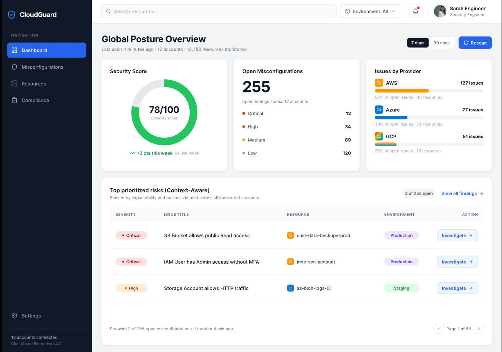
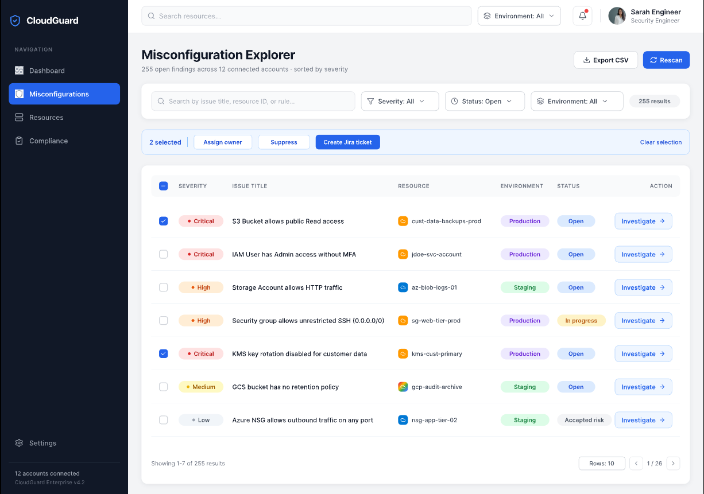
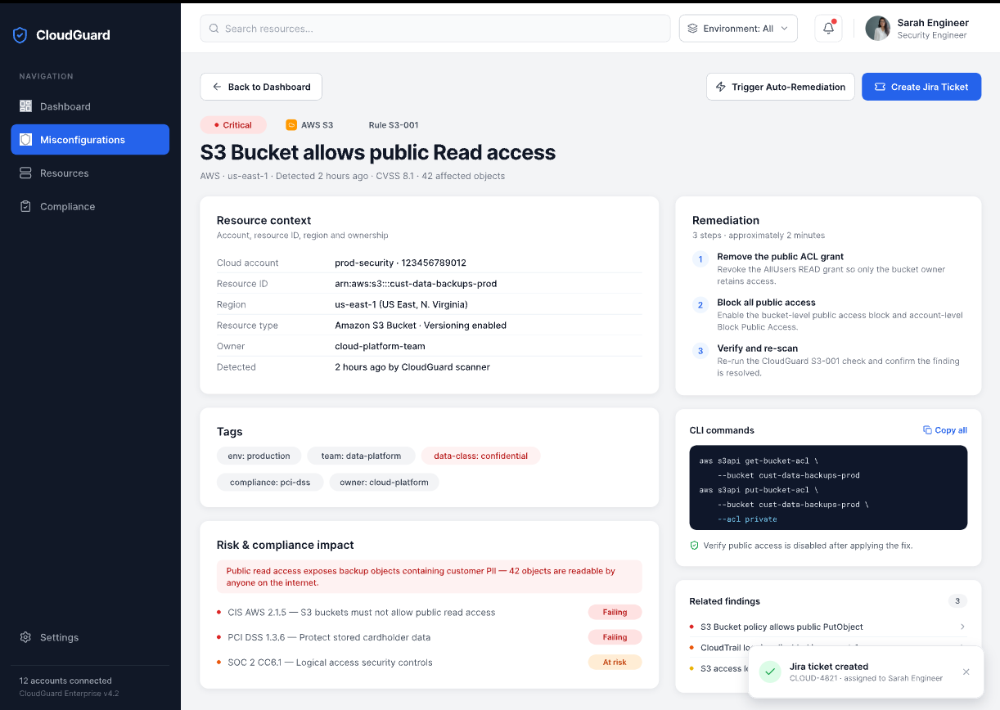

# Cloud Posture Dashboard Design

**Figma Prototype Link:** [https://pixso.net/app/presentation/H3fqVwic6MGsVPrF0M7cRw?pageId=0%3A1&frameId=2%3A1&zm=1&lp=1&fi=2&hl=0&sa=0&su=1&zt=4 Invite you to join the Pixso Design file "Design file"]

---

## 1. Problem Statement & User Persona

**Problem Statement**  
Organizations utilizing multi-cloud environments (AWS, Azure, GCP) struggle to maintain a clear, unified view of their security posture. Misconfigurations are often scattered across different provider consoles, leading to alert fatigue. Security teams need a centralized dashboard to instantly identify, filter, and prioritize these risks based on actual business context (like environment and data sensitivity) rather than just generic CVSS severity scores.

**User Persona: Sarah, Cloud Security Engineer**  
* **Role & Goals:** Sarah is responsible for maintaining cloud compliance and triaging security alerts. Her primary goal is to quickly identify critical misconfigurations and assign remediation tasks to the appropriate DevOps teams.
* **Pain Points:** She is overwhelmed by thousands of low-priority alerts (alert fatigue). She struggles to correlate data across AWS and Azure, and often lacks immediate context on what a compromised resource actually does, delaying her decision-making.

---

## 2. Figma Wireframes with Annotations

The provided Figma file contains a 3-screen wireframe flow designed to solve Sarah's pain points. Annotations are included within the design to explain specific functionalities:

1. **Global Posture Overview (Dashboard):** Provides immediate high-level KPIs, an overall security score, and surfaces the top context-aware risks requiring immediate attention.
2. **Misconfiguration Explorer (List View):** A robust data table allowing the engineer to filter issues by severity, environment, and cloud provider, equipped with bulk-action checkboxes for rapid triage.
3. **Issue Detail & Context View:** A dedicated screen for a specific misconfiguration, providing full resource context (tags, region, owner) alongside actionable remediation playbooks and 1-click Jira ticket creation.

### Screen 1: Global Posture Overview

### Screen 2: Misconfiguration Explorer

### Screen 3: Issue Detail & Context View
 

---

## 3. Proposed Features, Prioritization & Metrics

### Proposed Features
1. **Unified Multi-Cloud Inventory:** Ingests and normalizes misconfiguration data across AWS, Azure, and GCP into a single, standardized format and severity scale.
2. **Context-Aware Prioritization Engine:** Dynamically adjusts the severity of an alert based on resource tags (e.g., automatically elevating a "Medium" severity issue to "Critical" if the resource is tagged `Env: Production` and `Data: PII`).
3. **Actionable Remediation Playbooks:** Embeds step-by-step CLI commands or Terraform snippets directly in the issue detail view, so engineers don't have to search through external documentation.
4. **Workflow & ITSM Integration:** 1-click integration to automatically generate Jira or ServiceNow tickets pre-filled with context, bridging the gap between Security and DevOps.

### Prioritization Strategy
* **P0 (Must Have):** Unified Inventory, Basic Filtering (Severity/Provider), Data Table View, and Issue Context Details.  
  *Reasoning: These form the foundational core of the product. Without visibility and basic filtering, the dashboard fails its primary purpose.*
* **P1 (Should Have):** Context-Aware Prioritization & Jira Integration.  
  *Reasoning: These features directly address the persona's pain points of alert fatigue and slow communication, making the tool highly sticky and valuable.*
* **P2 (Could Have):** Automated 1-click Auto-Remediation.  
  *Reasoning: Extremely high value, but technically complex and carries significant risk (modifying production infrastructure automatically). This is better suited for a V2 release once user trust is established.*

### Success Metrics
To measure the success of this dashboard, we will track:
1. **Time to Triage (TTT):** A decrease in the average time it takes an engineer to review, categorize, and assign a newly discovered misconfiguration.
2. **Mean Time to Remediate (MTTR):** A reduction in the overall lifecycle time of an alert from discovery to resolution.
3. **Adoption & Engagement (WAU):** Weekly Active Users of the dashboard, specifically tracking the number of complex filters applied or Jira tickets generated per session, which indicates active investigation over passive viewing.
